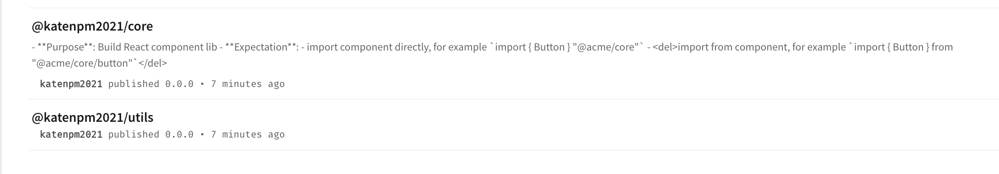
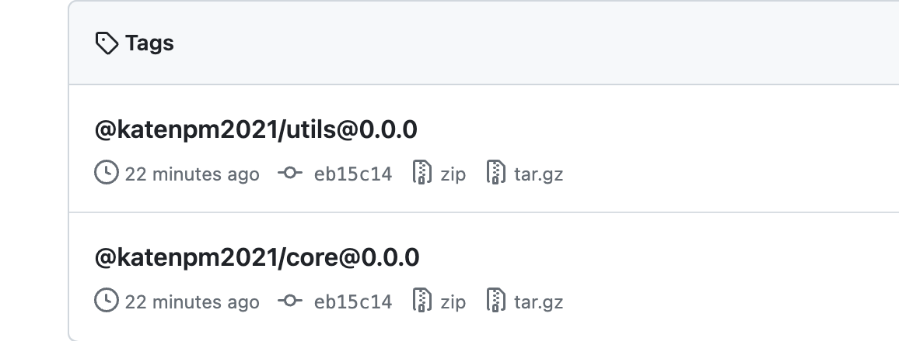

# README

- Generated from https://github.com/vercel/turbo/tree/main/examples/with-changesets/packages
- Purpose: A template for you to build public NPM packages

## Major Solutions Map

- [publish react lib](./packages/acme-core/)

## Result

- Package published to NPM registry: 

- Released package on Github
